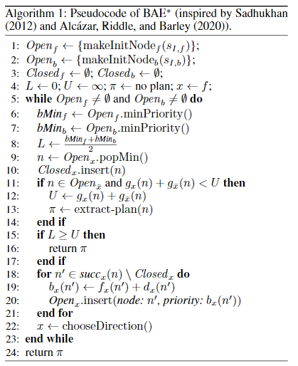

# COMP90054 AI Planning for Autonomy - Assignment 1 - Search 

You must read fully and carefully the assignment specification and instructions detailed in this file. You are NOT to modify this file in any way.

* **Course:** [COMP90054 AI Planning for Autonomy](https://handbook.unimelb.edu.au/subjects/comp90054) @ Semester 2, 2022
* **Instructor:** Dr. Nir Lipovetzky and Prof. Adrian Pearce
* **Deadline:** Friday 19th August, 2022 @ 11:59pm (end of Week 4)
* **Course Weight:** 10%
* **Assignment type:**: Individual
* **ILOs covered:** 1, 2, and 3
* **Submission method:** via git tagging (see Submission Instructions below for instructions)

The **aim of this assignment** is to get you acquainted with AI search techniques and how to derive heuristics in Pacman, as well as to understand how to model a problem with python.

 <p align="center"> 
    
 </p>

## Your task

You **must build and submit your solution** using the sample code we provide you in this repository, which is different from the original [UC Berlkley code base](https://inst.eecs.berkeley.edu/~cs188/fa18/project1.html). If you want to provide a report with your submission (e.g., reflections, acknowledgments, etc.), please do so in file [REPORT.md](REPORT.md).

* Please remember to complete the [STUDENT.md](STUDENT.md) file with your individual submission details (so we can identify you when it comes time to submit). 

* You should **only work and modify** files [search.py](search.py) and [searchAgents.py](searchAgents.py) in doing your solution. Do not change the other Python files in this distribution.

* Your code **must run _error-free_ on Python 3.6**. Staff will not debug/fix any code. Using a different version will risk your program not running with the Pacman infrastructure or autograder and may risk losing (all) marks. 
   * You can install Python 3.6 from the [official site](https://www.python.org/dev/peps/pep-0494/), or set up a [Conda environment](https://www.freecodecamp.org/news/why-you-need-python-environments-and-how-to-manage-them-with-conda-85f155f4353c/) or an environment with [PIP+virtualenv](https://uoa-eresearch.github.io/eresearch-cookbook/recipe/2014/11/26/python-virtual-env/). 

* Your code **must not have any personal information**, like your student number or your name. That info should go in the [STUDENT.md](STUDENT.md) file, as per instructions above. If you use an IDE that inserts your name, student number, or username, you should disable that.

* **Assignment 1 FAQ** is available to answer common questions you might have about [Assignment 1 on ED](https://edstem.org/au/courses/9418/discussion/936735)

* **Getting started on GitHub** - the video below explains how to **clone**, **git add**, **commit** and **push** while developing your solution for this assignment:

[](https://www.loom.com/share/ae7e93ab8bec40be96b638c49081e3d9)


### Practice Task (0 marks)

To familiarize yourself with basic search algorithms and the Pacman environment, it is a good start to implement the tasks at https://inst.eecs.berkeley.edu/~cs188/fa18/project1.html, especially the first four tasks; however, there is no requirement to do so.

You should code your implementations *only* at the locations in the template code indicated by ```***YOUR CODE HERE***``` in files [search.py](search.py) and [searchAgents.py](searchAgents.py), please do not change code at any other locations or in any other files.

### Part 1 (3 marks)

Implement the **Enforced Hill Climbing algorithm** discussed in lectures, using Manhattan Distance as the heuristic, by inserting your code into the template indicated by comment ```***YOUR CODE HERE FOR TASK 1***```, you can view the location at this link: [search.py#L151](search.py#L151).

Note that you don't have to implement Manhattan Distance, as this has already been implemented for you in the template code, although you will need to call the heuristic from inside your search. You should be able to test the algorithm using the following command:

```
python pacman.py -l mediumMaze -p SearchAgent -a fn=ehc,heuristic=manhattanHeuristic
```

Other layouts are available in the layouts directory, and you can easily create you own. The `autograder` will try to validate your solution by looking for the exact output match.

### Part 2 (3 marks)

In this part we will prove that you have all the ingredients to pick up many new search algorithms, tapping to knowledge you acquired in the lectures and tutorials.

**Bidirectional  A\* Enhanced (BAE\*)** is a search algorithm that searches in both directions, from the intial state to the goal state, and from the goal state towards the initial state, and keeps track of solutions found when the two directions meet. In this assignment, for simplicity, we assume there is only one goal state, hence, progression and regression both search in the same state space, one uses the transition function forward, and the other backward. This algorithm has not been introduced in the lectures but it relies on ingredients which you already know: 
*  **A\***,  
* the evaluation function  used to guide the expansion order in **A\***, and
* the definition of the transition function  to generate a graph implicitly while searching. 

**BAE\*** is similar to A*, but:
1. It has two open lists (lines 1-2, Alg. 1) to alternate (line 22) expanding nodes (line 9) from the forward  and backward  lists.
2. While searcing, it keeps a lower bound  and upper bound  to know when to stop the search, i.e. when  (line 15), the incumbent solution has been proved to be optimal. The lower bound is updated each time a node is selected for expansion (lines 5-9, Alg. 1), keeping track of the average  value in both directions (line 8). Note that if the heuristic is **admissible**, then the minimum  value in the open lists represent a lower bound on the optimal solution cost.
3. The upperbound is only updated if the current node  exists in the open list of the opossite direction , which means that the two directions meet through node , and the cost of the path form the initial state to  + the cost of the path from  to the initial state of the opposite direction is smaller than the best solution known so far, i.e.  (line 11). If that's the case, keep the solution and update the upperbound (lines 12-13). 
4. The priority used to order nodes in the openlists is slightly different than A*. Given that every time a node is chosen for expansion we know that its  value represents the optimal cost to node  in direction , then we can characterize and correct the innacuracy of the heuristic  used in the opposite direction  as . This value is added to  and used to set the priority of each generated node  (lines 18-20).



This algorithm is taken from the [paper](https://ojs.aaai.org/index.php/SOCS/article/view/21756/21520) presented at the [Symposium on Combinatorial Search](https://sites.google.com/unibs.it/socs2022/home?authuser=0), on the 22nd of July, 2022. Bidirectional search is currently a hot research topic given recent theoretical results and simple practical algorithms such as BAE*. The paper that introduced these results received a prestigious best paper award in a [top conference in AI](https://aip.riken.jp/award/aaai-20_honorable_mention/). This context alone should motivate you: you are literally implementing a cutting-edge search algorithm.

Tips for your implementation:

- Checking membership of a node in the opposite open (line 11), can be a computationally expensive operation (worst case linear in the size of the open, which in turn is exponential as the depth of the search increases). This is specially relevant as this line is executed for every expanded state. Think back about your Data Structures course, and use an auxiliary data structure to implement the membership test efficiently for this assignment. Otherwise, BAE* will be way slower than A*, even if it expands less nodes. 
- To undestand what the search is doing, make sure that you understand the successor generators in both directions. In Backward search, given an action  and state , you need to generate the state  from which the application of  resulted in state .
- The function `getBackwardsSuccessors` has already reverses the action name for backwards search.
- The function `getGoalStates` returns a list of all possible goal states.

Implement the **BAE\* algorithm** discussed above by inserting your code into the template indicated by comment ```***YOUR CODE HERE FOR TASK 2***```, you can view the location at this link: [search.py#L169](search.py#L169). You should be able to test the algorithm using the following command:
```
python pacman.py -l mediumMaze -p BidirectionalSearchAgent -a fn=bae,heuristic=manhattanHeuristic,backwardsHeuristic=backwardsManhattanHeuristic
```
Other layouts are available in the layouts directory, and you can easily create your own. The `autograder` will seek for exact match of the solution and the number of node expansions. The successors list are expected to be visited in the original order given by the API. If your node expansion number is incorrect, please try to **reverse** it. An example is given as follows:
```
succs = problem.getSuccessors(state)
succs.reverse()
```

### Part 3 (4 marks)

This part involves solving a more complicated problem. You will be able to model the problem, using the **BAE\* algorithm** from part 2 and design a heuristic function that can guide the search algorithm. 

Just like in Q7 of the Berkerley Pacman framework, you will be required to create an agent that eats all the food (dots) in a maze. 

In order to implement this, you should create a new problem called `BidirectionalFoodSearchProblem`. Some of the variables are listed in the comments and the initialization. You will need to:

1. Design a way to represent the states of the problem. 
2. Return the initial state through `getStartState` function. 
3. Have `getGoalStates` to return a list of all possible goal states. 
4. Implement your transition function in `getSuccessors`, which should return a list of tuples that contains (`next state`, `action`, `cost`). 
5. Implement `getBackwardsSuccessors` function to search in backwards.
6. Implement two suitable heuristics, `bidirectionalCapsuleProblemHeuristic` and `bidirectionalCapsuleProblemBackwardsHeuristic`. 

Make sure your heuristic is admissible and consistent, as we don't check for reopening, and the optimality guarantees would be lost  because the assumption on the optimality of  would be wrong when errors  are computed. 

You may choose to implement other helper classes/functions. 

You should insert your code into the template indicated by the comments ```***YOUR CODE HERE FOR TASK 3***```, you can view the locations after Line [searchAgents.py#L781](searchAgents.py#L781).

Tips for your implementation:
- It is important to make sure the transition from `getBackwardsSuccessors` is the exact reverse of `getSuccessors`. 
- As there is not a single way to model this problem, we would not be checking node expansion numbers. However, please make sure that your code runtime is not too long. Our marking scripts will allow a time budget for each test case as 3 times the runtime of our staff's code with the blind heuristic that assigns each state a value of 0. 
- Although a heuristic function is not compulsory, however, a good heuristic function is going to improve your code's running time. We would recommend to try different heuristics to compare the running time and node expansion numbers. Start with the easiest one. 
- Running time for staff's code with zero heuristic on the mediumCorners is **664 seconds** and on the smallCorners is **2 seconds**. Note that we could test your submission on different layouts, however this will give you a good guide for comparing the expected performance of your solution.

You should be able to test your program by running the following commands (in one line):

```
python pacman.py -l smallCorners -p BidirectionalFoodSearchAgent -a fn=bae,heuristic=bidirectionalFoodProblemHeuristic,backwardsHeuristic=bidirectionalFoodProblemBackwardsHeuristic
```

The `autograder` seeks an optimal solution length within the time budget for each test cases. In addition, please make sure your heuristic is **admissible and consistent**, otherwise you might get 0 marks for this part due to not finding the optimal plan.


You will see in first person the balance between 1) how informed you make your heuristic (it should expand less nodes in general), and 2) the overall runtime. As you can see, sometimes it may be preferable to have a cheaper less informed heuristic, even if you end up expanding more nodes.

## Marking criteria

Marks are allocated according to the task breakdown listed above, based on how many of our tests the algorithms pass. No marks will be given for code formatting, etc. Observe that while the autograder is a useful indication of your performance, it may not represent the ultimate mark. We reserve the right to run more tests, inspect your code and repo manually, and arrange for a face-to-face meeting for a discussion and demo of your solution if needed.  You must **follow good SE practices**, including good use of git during your development such as:

* _Commit early, commit often:_ single or few commits with all the solution or big chucks of it, is not good practice.
* _Use meaningful commit messages:_ as a comment in your code, the message should clearly summarize what the commit is about. Messages like "fix", "work", "commit", "changes" are poor and do not help us understand what was done.
* _Use atomic commits:_ avoid commits doing many things; let alone one commit solving many questions of the project. Each commit should be about one (little but interesting) thing. 

## Checking your submission

Run the following command to run sanity checks using our test files:

```
python ./autograder.py --test-directory=test_cases_assignment1
```

It is important that you are able to run the autograder and have these tests pass, otherwise, our marking scripts will NOT work on your submission.

**NOTE**: You should not change any files other than [search.py](search.py) and [searchAgents.py](searchAgents.py). You should not import any additional libraries into your code. This risks being incompatible with our marking scripts.


## Submission Instructions

This repository serves as a start code for you to carry out your solution for [Project 1 - Search](http://ai.berkeley.edu/search.html) from the set of [UC Pacman Projects](http://ai.berkeley.edu/project_overview.html) and the marked questions. 

**To submit your assignment** you must complete the following **four** steps:

1. Complete the [STUDENT.md](STUDENT.md) file with your details of the submission.
2. Check that your solution runs on Python 3.6 and that your source code does not include personal information, like your student number or name. 
3. Tag the commit version you want to be graded with tag `submission`. 
    * The commit and tagging should be dated before the deadline.
    * Note that a tag is NOT a branch, so do not just create a branch called "submission" as that will not amount to tagging.
    * Note that a tag is NOT a commit message, so please make sure you can find it in your repo page -> tag
    * It is case-sensitive.
4. Fill the [Assignment 1 Certification Form](https://forms.gle/3W8ntjbW6Qq6NMvZA).
    * Non-certified submissions will **not** be marked and will attract **zero** marks.
    


From this repository, we will copy *only* the files: [search.py](search.py) and [searchAgents.py](searchAgents.py). Please do not change any other file as part of your solution, or it will not run. Breaking these instructions breaks our marking scripts, delays marks being returned, and more importantly, gives us a headache. Submissions not compatible with the instructions in this document will attract zero marks and do not warrant a re-submission. Staff will not debug or fix your submission.

Please view the following to learn how to *Tag* your commit version you want to be graded:

**How to create a Tag using the Command Line**:


[](https://www.loom.com/share/17ec72b954454bc89bbe1dbb0bd2874f)

**Another way to create a Tag using the User Interface**:

[](https://www.loom.com/share/3cd39e97919e4b688d9841613aba6973)

## Important information

**Corrections:** From time to time, students or staff find errors (e.g., typos, unclear instructions, etc.) in the assignment specification. In that case, corrected version of this file will be produced, announced, and distributed for you to commit and push into your repository.  Because of that, you are NOT to modify this file in any way to avoid conflicts.

**Late submissions & extensions:** A penalty of 10% of the maximum mark per day will apply to late assignments up to a maximum of five days, and 100% penalty thereafter. Extensions will only be permitted in _exceptional_ circumstances; refer to [this question](https://docs.google.com/document/d/17YdTmDC54WHq0uZ-2UX3U8ESwULyBDJSD4SjKCrPXlA/edit?usp=sharing) in the course FAQs. 

**About this repo:** You must ALWAYS keep your fork **private** and **never share it** with anybody in or outside the course, except your teammates, _even after the course is completed_. You are not allowed to make another repository copy outside the provided GitHub Classroom without the written permission of the teaching staff. Please respect the [authors request](http://ai.berkeley.edu/project_instructions.html): 

> **_Please do not distribute or post solutions to any of the projects._**

**Academic Dishonesty:** This is an advanced course, so we expect full professionalism and ethical conduct.  Plagiarism is a serious issue. Please **don't let us down and risk our trust**. The staff take academic misconduct very seriously. Sophisticated _plagiarism detection_ software (e.g., [Codequiry](https://codequiry.com/), [Turinitin](https://www.turnitin.com/), etc.) will be used to check your code against other submissions in the class as well as resources available on the web for logical redundancy. These systems are really smart, so just do not risk it and keep professional. We trust you all to submit your own work only; please don't let us down. If you do, we will pursue the strongest consequences available to us according to the **University Academic Integrity policy**. For more information on this see file [Academic Integrity](ACADEMIC_INTEGRITY.md).

**We are here to help!:** We are here to help you! But we don't know you need help unless you tell us. We expect reasonable effort from you side, but if you get stuck or have doubts, please seek help. We will ran labs to support these projects, so use them! While you have to be careful to not post spoilers in the forum, you can always ask general questions about the techniques that are required to solve the projects. If in doubt whether a questions is appropriate, post a Private post to the instructors.

**Silence Policy:** A silence policy will take effect **48 hours** before this assignment is due. This means that no question about this assignment will be answered, whether it is asked on the newsgroup, by email, or in person. Use the last 48 hours to wrap up and finish your project quietly as well as possible if you have not done so already. Remember it is not mandatory to do all perfect, try to cover as much as possible. By having some silence we reduce anxiety, last minute mistakes, and unreasonable expectations on others. 

Please remember to follow all the submission steps as per assignment specification.

## COMP90054 Code of Honour

We expect every UoM student taking this course to adhere to it **Code of Honour** under which every learner-student should:

* Submit their own original work.
* Do not share answers with others.
* Report suspected violations.
* Engage in any other activities that will dishonestly improve their results or dishonestly improve or damage the results of others.

Unethical behaviour is extremely serious and consequences are painful for everyone. We expect enrolled students/learners to take full **ownership** of your work and **respect** the work of teachers and other students.


**I hope you enjoy the assignment and learn from it**, and if you still **have doubts about the assignment and/or this specification** do not hesitate asking in the [ED discussion Forum](https://edstem.org/au/courses/9418/discussion/) and we will try to address it as quickly as we can!

**GOOD LUCK and HAPPY PACMAN!**

## Acknowledgements

This is [Project 1 - Search](http://ai.berkeley.edu/search.html) from the set of [UC Pacman Projects](http://ai.berkeley.edu/project_overview.html).  We are very grateful to UC Berkeley CS188 for developing and sharing their system with us for teaching and learning purposes.
